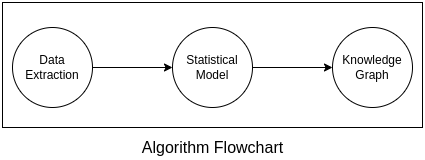
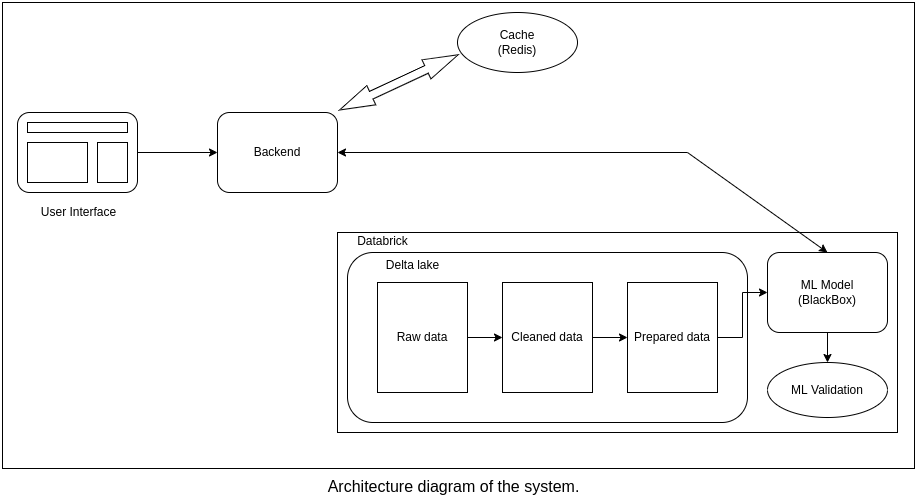

## 1a. Flowchart of the Algorithm

According to the algorithm mentioned in the paper, it involves 3 main steps --
1. Data Extraction
2. Statistical Model
3. Knowledge graph

### Data Extraction :
Semi-structured and unstructured data are cleaned and extracted to train the model.

Data has relationships between Symptoms to disease and Diseases to Specialization

### Statistical Model :
Involves one or more ML concepts like Logistic regression, Naive Bayes and Noisy OR that gives the predictions

### Knowledge Graph :
The preductions were combined to form a knowledge graph

## 1b. Architecture of the system

As mentioned in the assignment docs, I am focusing on the given Problem Statement.

__Problem Statement:__ A system that asks patients their symptoms and
related questions, predict the possible conditions and recommend relevant specializations (of doctors) to the patient.

---

### Explanation of the Architecture

__User Interface :__

Interface plays an important role since our prediction depends on the user Input.

We accepts "Symptoms" which can be multiple entries.
But the symptoms can be called different by different people.

Eg: bullseye, bullseye rash, bull eye, bull’s eye, etc.

It is better to provide strong auto suggestion feature as the user starts entering the symptoms.

We send the symptoms via REST api to the Backend

__Backend :__
Backend can be a simple express or flask server. In this architecture, we are not with Immersive Model-as-a-Service. We have a seperate model service hosted via databrick.

### Databrick --
__Delta lake :__

Since we are working with Semi-structured and unstructured data, for main Database we can go with MongoDB or Neo4J.

Since we are working with medical data, and it goes lots of reviews. This data not likely to inserted from any customer side.

So we assume we have data injestion happens within organization we can have other service for that.

Delta lake helps to organize the huge raw data, clean it and prepare it that fed to the model training.

__ML model (Blackbox) :__

Where we train the model to compile the predictions. This is Real-time Model as a Service , the model responds to those inputs in real-time.

- This model has to perform both Compute-heavy tasks and Data-heavy tasks
- Online prediction -- As soon as requests come
- Cloud computing -- Done on cloud, Need network connections for speedy data transfer
- Offline Learning -- Cadence of learning: weekly/monthly, Batch Size: larger sample, Mostly offline evaluations

__ML Validation and evaluation:__
Prediction has to be validated against GHKG and the medical personals review.

__Cache :__

Users most likely to come back and retest the results or in the seasons where diseases like flu, common cold and viral fever, etc.
Many users are searching for the same symptoms.

So, it is good to cache predicted results for some time.

### Pros
- Since we are using databrick, it gives lot many things out of the box, like -- Infrastructure maintainance, Delta lake, Multiple language support (Python, R, Scala) and Spark as query engine,
Data Privacy
- We can horizantally scale the application and the model also.
- Unified platform to both data-engineers and data-scientists

### Cons
- Caching of symptoms-to-predictions(input-to-output) is slightly trickier
- High latency

## 1c. To evaluate performance of the system.

We going to monitor logs from both databrick and cloud platform(AWS|Azure).
If we have to get the application metrics we can configure Prometheus and Grafana

Since ML performance can be measured seperately